<div align="center">

# 🌌 StudyFlow

### Premium Workflow Automation Companion for Canvas LMS

*Less time navigating repetitive dashboards. More time focusing on what matters.*

[](https://www.npmjs.com/package/studyflow-bot)
[](https://www.npmjs.com/package/studyflow-bot)
[](https://nodejs.org/)
[](LICENSE)

</div>

---

## 🎨 Dual-Interface Experience

StudyFlow gives you the freedom to choose your workflow. Toggle between a **premium interactive CLI** and a **sleek Glassmorphism Web Dashboard** in a single click.

### 1. The Interactive CLI Terminal
Operating with zero lag, our custom command terminal provides a gorgeous color-coded dashboard featuring custom violet and pink themes to control all automation tasks.

```text
  ╭────────────────────────────────────────────────────────╮
  │  StudyFlow ◆ v1.2.2         Canvas Learning Companion  │
  ╰────────────────────────────────────────────────────────╯

  Select StudyFlow mode:
  ● Command Line Interface (Interactive menu)
  ○ Web UI Dashboard
```

### 2. Glassmorphism Web Dashboard
A high-performance local dashboard running at `http://localhost:3000` with fluid layout animations, real-time progress fills, detailed statistics counters, responsive sidebar navigation, and a live dark terminal log stream.

---

## ✨ Features

- 🌐 **Bilingual (English & Korean)** — Native English & Korean (한국어) support across CLI menus, terminal guides, interactive prompts, and diagnostic utilities.
- 🔄 **Sequential Course Sweep** — Scan and sequentially complete pending video modules across all enabled courses without manual navigation.
- 🎯 **Targeted Watch Sessions** — Pick one specific course or direct your attention to a single selected video.
- 💨 **Double Playback Speed** — Default standard 2.0x video playback stream to save maximum time.
- 🕶️ **Seamless Background Operation** — Switch "Headless Mode" on to run your tasks silently in the background while you study.
- 🔒 **Zero-Trust Security** — Student login details stay locally on your personal machine with strict file permissions (`0o600`).
- ⚡ **Auto-SSO Integration** — Intelligent login workflows that bypass multi-step Single Sign-On authentications effortlessly.

---

## 🚀 Simple Step-by-Step Installation

We designed StudyFlow to be simple, clean, and quick to set up—even if you have never touched a terminal or written a single line of code in your life.

---

### 1️⃣ Step 1: Install Node.js (Your system engine)
StudyFlow requires a safe, secure, and completely free helper engine called **Node.js** to run.
* **Windows Users**: 📥 [**Download Node.js Installer for Windows**](https://nodejs.org/dist/v20.12.2/node-v20.12.2-x64.msi)
* **Mac Users**: 📥 [**Download Node.js Installer for Mac**](https://nodejs.org/dist/v20.12.2/node-v20.12.2.pkg)
* **Linux Users**: Run `sudo apt update && sudo apt install -y nodejs npm` in your terminal.

> [!NOTE]
> Once your download finishes, just double-click the file and click **"Next"** or **"Agree"** through the standard setup wizard. No custom configurations needed!

---

### 2️⃣ Step 2: Open your Terminal / Command Window
Now, open your computer's terminal to input a command:
* 🪟 **On Windows**: Press the **Windows Key** on your keyboard, type **`cmd`**, and press **Enter** (this opens Command Prompt).
* 🍎 **On Mac**: Press **Command (⌘) + Spacebar** at the same time, type **`Terminal`**, and press **Enter**.

---

### 3️⃣ Step 3: Install StudyFlow with 1 Command
Copy the line of text below, paste it into your terminal/command window, and press **Enter**:

* **Windows Users**:
  ```bash
  npm install -g studyflow-bot
  ```
* **Mac & Linux Users**:
  ```bash
  sudo npm install -g studyflow-bot
  ```
*(This will securely install the StudyFlow assistant onto your local system. Installation will wrap up in about 30 seconds!)*

---

### 4️⃣ Step 4: Launch and Log In!
Type the command below in your terminal/command window and press **Enter**:
```bash
studyflow
```
*   **🌐 Language First**: On your very first launch, choose either **English** or **한국어 (Korean)** to fit your comfort level.
*   **🖥️ Choose Interface**: Select **Web UI Dashboard** or **Command Line Interface (CLI)** dynamically, with prompts rendered in your chosen language.
*   **🎉 You are ready!** Enter your Canvas credentials securely when prompted, and let the assistant handle the heavy lifting!

---

## 🛠️ Commands Reference

If you prefer using terminal commands directly, StudyFlow comes with structured subcommands:

| Command | Action |
|---------|--------|
| `studyflow` | Launches the interactive mode select wizard (CLI / Web Dashboard) |
| `studyflow sweep` | Launches an automated sweep through all enabled courses |
| `studyflow watch` | Prompts you to pick one course to watch sequentially |
| `studyflow target` | Lets you choose one specific lesson unit |
| `studyflow config` | Configure enabled/disabled course scopes |
| `studyflow fetch-courses` | Syncs and caches your course rosters from Canvas |

---

## 🔄 Updating & Uninstalling

### How to Update StudyFlow
Keep your local installation updated to match any Canvas LMS layout changes:
* **Windows**:
  ```bash
  npm update -g studyflow-bot
  ```
* **Mac & Linux**:
  ```bash
  sudo npm update -g studyflow-bot
  ```

### How to Uninstall StudyFlow
To completely remove StudyFlow and wipe its temporary cache:
1. Uninstall the global package:
   * **Windows**:
     ```bash
     npm uninstall -g studyflow-bot
     ```
   * **Mac & Linux**:
     ```bash
     sudo npm uninstall -g studyflow-bot
     ```
2. (Optional) Wipe your configuration files:
   * **Windows**: Delete `C:\Users\<YourUsername>\.config\studyflow`
   * **Mac & Linux**: `rm -rf ~/.config/studyflow`

---

## 🔒 Security & Privacy Architecture

We built StudyFlow on the foundational principle that **your private student data belongs to you**.

```mermaid
graph TD
  User((Student)) -->|Launches| CLI[StudyFlow CLI / Web UI]
  CLI -->|Reads / Writes| Storage[(Local Disk Storage ~/.config/studyflow/)]
  CLI -->|Controls| Browser[Playwright Chromium Instance]
  Browser -->|Direct Authenticate| Institution[Your School SSO SSO/Canvas Server]
  
  style Storage fill:#181825,stroke:#a895ff,stroke-width:2px;
  style Browser fill:#181825,stroke:#ff8fd6,stroke-width:2px;
  style Institution fill:#111116,stroke:#ff7b7b,stroke-width:2px;
```



- **Credential Isolation:** Credentials are encrypted and saved strictly on your local disk at `~/.config/studyflow/` with secure read/write boundaries.
- **Direct Connection:** Authenticates directly with your university portal. Absolutely no middleman servers, APIs, proxies, or cloud synchronization.
- **No Telemetry:** We collect zero analytics, metrics, or usage logs. Everything is offline-first.

---

## 📚 Troubleshooting

#### "Command not found: studyflow"
Ensure Node.js is on your system path. Close and reopen your terminal or command prompt, then run `npm install -g studyflow-bot` again.

#### "Playwright Browser Engine Missing"
Upon your very first launch, StudyFlow will automatically configure a lightweight, isolated browser engine inside its cache directory. This is a one-time automated setup.

#### Password change or credential failure
Simply select the `🔑 Reset Session Credentials` option in the CLI or input your updated student account passwords in the Settings tab of the Web Dashboard.

---

## ⚖️ Disclaimer

StudyFlow is a productivity tool meant to streamline and centralize dashboard workflows. Please use it responsibly and ensure your usage aligns with your academic institution's acceptable use policies, code of conduct, and academic integrity regulations. StudyFlow maintainers are not liable for any misuse, policy infractions, or custom Canvas LMS updates breaking current automation logic.

---

<div align="center">

**Crafted with care for students who value their time.**

[NPM Package Registry](https://www.npmjs.com/package/studyflow-bot) • [Source Code Repository](https://github.com/husky-696/StudyFlow)

</div>